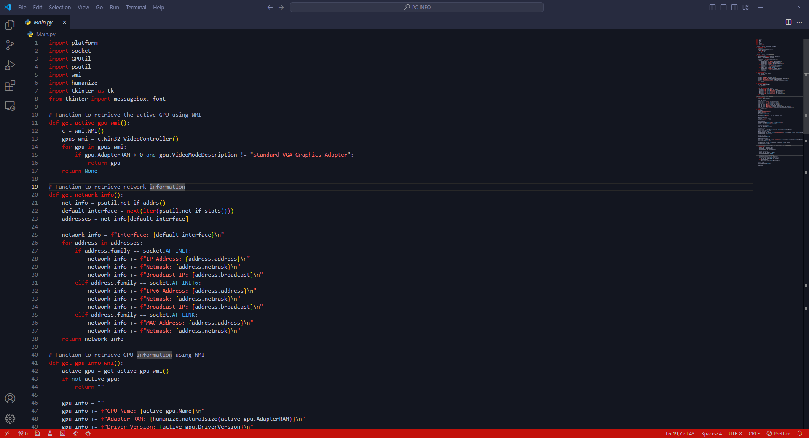

# Midnight Blue theme for Visual Studio Code

This is a dark Blue theme for Visual Studio Code.

### Showcase of the theme

## Installation

1. Open the Extensions sidebar in VS Code. `View → Extensions`
2. Search for `Midnight Blue`, and install it.
3. Go to `File → Preferences → Color Theme` (or `Ctrl+K Ctrl+T`) and select `Midnight Blue`.